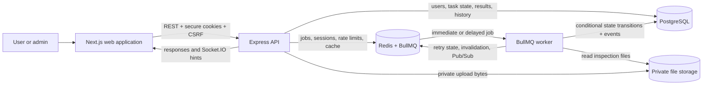
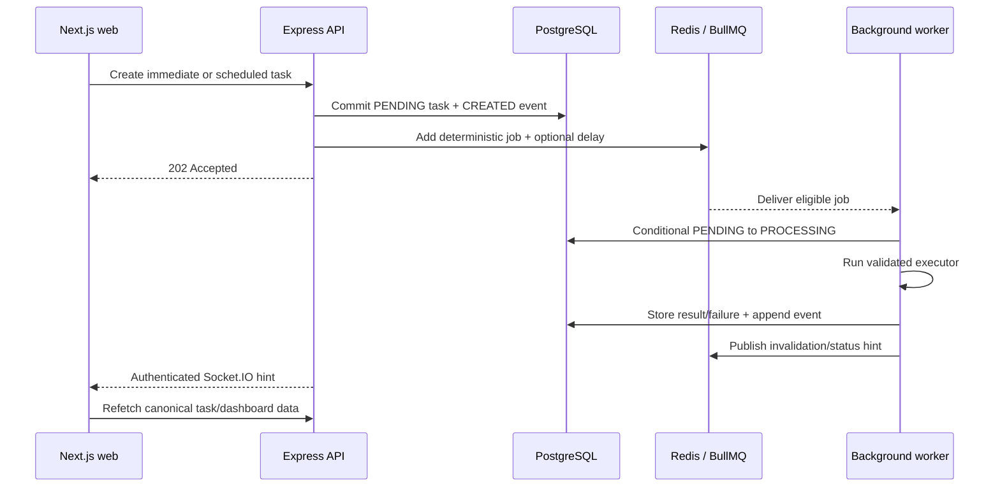

# TaskForge

TaskForge is a multi-user task automation and asynchronous job-processing platform. It lets users submit work now or schedule it for later, processes that work outside the HTTP request, and provides a durable status, result, and audit history for every execution.

> **Deployment status:** TaskForge is not publicly deployed for this assessment. The complete product can be reproduced locally with the steps below using either local development processes or Docker Compose.

## What problem does TaskForge solve?

Normal HTTP requests are a poor place to run slow or failure-prone work: the browser can time out, retries can accidentally execute the same work twice, and users cannot see what happened after the request ends.

TaskForge separates **submitting a task** from **executing a task**:

- The API validates and accepts work quickly.
- PostgreSQL stores the authoritative task state and append-only history.
- BullMQ and Redis deliver immediate or delayed jobs to a separate worker.
- The worker handles execution, bounded retries, results, and failures.
- The web application shows dashboard counts, searchable tasks, history, and live status updates.

This design is useful for document inspection, data transformation, report generation, imports, notifications, media processing, and other background workflows that should remain reliable even when a browser disconnects.

## Product capabilities

| Area            | What TaskForge provides                                                                                        |
| --------------- | -------------------------------------------------------------------------------------------------------------- |
| Accounts        | Registration, login, logout, rotating refresh sessions, and `USER`/`ADMIN` roles                               |
| Dashboard       | Total, pending, processing, completed, and failed task counts                                                  |
| Task management | Create, view, edit, soft-delete, search, filter, sort, paginate, schedule, and retry                           |
| Text processing | Deterministic text transformation and analysis in a background worker                                          |
| File inspection | Private image/PDF upload with type, size, metadata, and SHA-256 inspection                                     |
| Reliability     | Deterministic job IDs, execution versions, conditional state transitions, retries, and dispatch reconciliation |
| Auditability    | Current task snapshot plus append-only lifecycle events                                                        |
| Live experience | Authenticated Socket.IO status hints followed by a canonical API refetch                                       |
| Administration  | Read-only system-wide task and dashboard views for the seeded admin                                            |

Task statuses follow this lifecycle:

```text
PENDING -> PROCESSING -> COMPLETED
              \-----> FAILED -> manual retry -> PENDING
```

A scheduled task remains `PENDING` until its requested execution time.

## How a task is processed

1. A signed-in user creates an immediate or scheduled task in the Next.js application.
2. The Express API validates the request, CSRF token, role, and resource ownership.
3. The API commits a `PENDING` task and its first history event to PostgreSQL.
4. A deterministic BullMQ job is added to Redis, with a delay when `scheduledAt` is in the future. The API returns `202 Accepted`; it never performs the task inline.
5. The worker conditionally claims the current execution and moves it to `PROCESSING`. Duplicate or stale deliveries cannot claim the same execution.
6. The selected executor processes text or inspects the uploaded files.
7. The worker records `COMPLETED`, a retry, or `FAILED` together with an append-only event. Transient failures use bounded exponential backoff.
8. Redis Pub/Sub and Socket.IO notify the browser that something changed. The browser refetches PostgreSQL-backed API data as the source of truth.

## Technology stack

| Layer                    | Technology                                                                       |
| ------------------------ | -------------------------------------------------------------------------------- |
| Web                      | Next.js 16, React 19, TypeScript, TanStack Query, Redux Toolkit, React Hook Form |
| API                      | Node.js 24 LTS, Express 5, Zod, Swagger/OpenAPI, Socket.IO                       |
| Data                     | PostgreSQL 18, Prisma 7                                                          |
| Jobs and ephemeral state | Redis 7.2, BullMQ 6                                                              |
| Security                 | Argon2id, JWT access cookies, rotating Redis refresh sessions, CSRF, CORS, RBAC  |
| Quality and delivery     | Jest, Supertest, Docker Compose, GitHub Actions                                  |

## Run locally — recommended development setup

This option runs PostgreSQL and Redis in Docker while the API, worker, and web application run in separate terminals with development watch mode.

### 1. Prerequisites

Install:

- [Git](https://git-scm.com/)
- [Docker Desktop](https://www.docker.com/products/docker-desktop/), with Docker Compose
- Node.js `24.18.1` (the repository pins this version in `.node-version`)
- pnpm `10.12.1`

You do **not** need to replace your global Node.js version. A version manager such as `fnm` or `nvm` can select Node 24 only inside this repository.

Example with `fnm`:

```bash
fnm install 24.18.1
fnm use 24.18.1
```

### 2. Clone the repository

```bash
git clone https://github.com/maadhav6677/Taskforge.git
cd Taskforge
```

Run the remaining commands from the repository root so the pinned Node version is detected.

### 3. Enable pnpm and install dependencies

```bash
node --version
corepack enable
corepack prepare pnpm@10.12.1 --activate
pnpm --version
pnpm install --frozen-lockfile
```

Expected major versions are Node `24.x` and pnpm `10.x`.

### 4. Create the local environment file

```bash
cp .env.example .env
```

The committed values are development-only defaults for local PostgreSQL, Redis, API, web, cookies, and file storage. Do not reuse the example JWT secrets in a public environment.

### 5. Start PostgreSQL and Redis

```bash
docker compose up -d postgres redis
docker compose ps
```

Wait until `taskforge-postgres` reports `healthy`. Redis is ready when its container is running.

### 6. Generate the Prisma client, migrate, and seed the database

```bash
pnpm db:generate
pnpm db:migrate
pnpm db:seed
```

Migrations create the schema and indexes. The idempotent seed adds demo users and representative task history.

### 7. Start each application service

Keep all four commands running. Open a separate terminal for each command and run it from the repository root.

**Terminal 1 — API**

```bash
pnpm --filter @taskforge/api start:dev
```

**Terminal 2 — background worker**

```bash
pnpm --filter @taskforge/api start:worker:dev
```

**Terminal 3 — Next.js web application**

```bash
pnpm start:web
```

**Terminal 4 — optional logs for infrastructure**

```bash
docker compose logs -f postgres redis
```

The worker is a required runtime: without it, tasks can be created and viewed but will remain pending instead of being processed.

### 8. Open and verify the application

| Resource                  | URL                                         |
| ------------------------- | ------------------------------------------- |
| TaskForge web app         | <http://localhost:3000>                     |
| Swagger API documentation | <http://localhost:4000/api/v1/docs>         |
| API liveness              | <http://localhost:4000/api/v1/health/live>  |
| API dependency readiness  | <http://localhost:4000/api/v1/health/ready> |

The readiness endpoint should return HTTP `200` after PostgreSQL and Redis are available.

### 9. Sign in with a seeded account

Both local accounts use password `TaskForge123!`.

| Role  | Email                   | Intended view                                             |
| ----- | ----------------------- | --------------------------------------------------------- |
| User  | `user@taskforge.local`  | Personal dashboard, tasks, files, history, and retry flow |
| Admin | `admin@taskforge.local` | Read-only global dashboard and task list                  |

You can also register a new user from the login screen.

### 10. Stop the local setup

Press `Ctrl+C` in the API, worker, and web terminals, then stop the infrastructure containers:

```bash
docker compose down
```

Named Docker volumes keep PostgreSQL and Redis data between runs. Development uploads remain in the ignored local `storage/tasks` directory.

## Run the complete application with Docker Compose

This option builds production-style images and runs all five services in containers. Node and pnpm are still used once on the host for migrations and seed data because the smaller runtime images intentionally do not contain the Prisma migration toolchain.

After cloning the repository, selecting Node 24, installing dependencies, and creating `.env` as shown above:

### 1. Start the data services

```bash
docker compose up -d postgres redis
```

### 2. Prepare the database

```bash
pnpm db:generate
pnpm db:migrate
pnpm db:seed
```

### 3. Build and start the API, worker, and web containers

```bash
docker compose up --build -d api worker web
docker compose ps
```

### 4. Follow application logs

```bash
docker compose logs -f api worker web
```

Open <http://localhost:3000> and use the same seeded accounts. Stop the stack with:

```bash
docker compose down
```

### What Docker runs

| Compose service | Responsibility                                                          | Host port | Persistent data                |
| --------------- | ----------------------------------------------------------------------- | --------: | ------------------------------ |
| `web`           | Production Next.js UI                                                   |    `3000` | None                           |
| `api`           | Express REST API, auth, uploads, Swagger, and Socket.IO                 |    `4000` | Shared `task-uploads` volume   |
| `worker`        | BullMQ job claiming, execution, retry, finalization, and reconciliation |      None | Shared `task-uploads` volume   |
| `postgres`      | Durable users, tasks, results, attachment metadata, and history         |    `5432` | `postgres-data-v18` volume     |
| `redis`         | BullMQ queues, delayed jobs, sessions, rate limits, cache, and Pub/Sub  |    `6379` | AOF-backed `redis-data` volume |

The API and worker use separate runtime targets from the same backend Dockerfile. They can be restarted or scaled independently while sharing the same business modules.

If port `5432` or `6379` is already in use, update `TASKFORGE_POSTGRES_PORT` or `TASKFORGE_REDIS_PORT` in `.env` and update the corresponding localhost URL in that file.

## Useful project commands

```bash
# Format, lint, typecheck, test, and build every workspace
pnpm ci:check

# Run real PostgreSQL/Redis/BullMQ integration tests
pnpm test:integration:postgres

# Validate Compose and build all container images
pnpm docker:check

# Build all workspaces
pnpm build
```

The integration runner only recreates a database whose name ends in `_test` and uses Redis database `15`. Never point `DATABASE_URL_TEST` at shared or production data.

## API and supporting artifacts

- Interactive OpenAPI/Swagger UI: <http://localhost:4000/api/v1/docs>
- Import [`postman/TaskForge.postman_collection.json`](postman/TaskForge.postman_collection.json) into Postman and run its requests in order for an authenticated smoke workflow.
- The browser and Postman collection use HttpOnly authentication cookies plus a CSRF cookie/header pair. Access or refresh tokens are never copied into frontend storage.

## Repository structure

```text
Taskforge/
├── apps/
│   ├── api/                    # Express API, worker, Prisma schema/migrations, tests
│   └── web/                    # Next.js application and component tests
├── packages/
│   └── contracts/              # Shared Zod wire contracts and public enums
├── docs/                       # Product, architecture, API, data, security, and delivery docs
├── postman/                    # Importable API smoke collection
├── .github/workflows/          # CI quality and container checks
├── docker-compose.yml          # Five-service local production topology
└── .env.example                # Documented development configuration
```

## High-level design (HLD)

TaskForge is a modular monolith with one codebase and two separately runnable backend processes: the Express API and the BullMQ worker. PostgreSQL is the durable source of truth; Redis provides queue and ephemeral coordination mechanics.



### Runtime responsibilities

| Runtime       | Owns                                                                                          | Does not own                       |
| ------------- | --------------------------------------------------------------------------------------------- | ---------------------------------- |
| Next.js web   | Presentation, forms, URL list controls, server-state queries, client-only UI state            | Authorization or token persistence |
| Express API   | Validation, authentication, authorization, use cases, persistence, dispatch, uploads, OpenAPI | Executing task work inline         |
| BullMQ worker | Job validation, conditional claim, executors, retry/finalization, reconciliation              | The public HTTP contract           |
| PostgreSQL    | Durable product state and append-only history                                                 | Sessions, cache, or queue timing   |
| Redis         | Job delivery, refresh sessions, rate limits, bounded cache, and status hints                  | Durable user-visible truth         |

### Request-to-worker sequence



### Reliability rules

- HTTP requests never execute task work.
- PostgreSQL remains correct if Redis cache or Socket.IO is unavailable.
- BullMQ delivery is treated as at-least-once; deterministic job IDs, execution versions, and conditional claims prevent duplicate execution of the current task.
- A failed enqueue does not lose the durable task. The worker periodically reconciles current pending, undispatched tasks.
- Backend policies and database predicates enforce roles and ownership. Frontend guards improve UX only.
- Uploaded files stay private and are downloaded only after authorization.

## Documentation

- [Product requirements](docs/requirements.md)
- [Architecture](docs/architecture.md)
- [HLD and LLD implementation map](docs/system-design.md)
- [Technical decisions and trade-offs](docs/decisions.md)
- [REST API and realtime contract](docs/api.md)
- [Database design](docs/database.md)
- [Security design](docs/security.md)
- [Coding and test conventions](docs/coding-style.md)
- [Delivery and submission checklist](docs/delivery.md)

Contributors and AI agents should read [AGENTS.md](AGENTS.md) before changing the repository.
