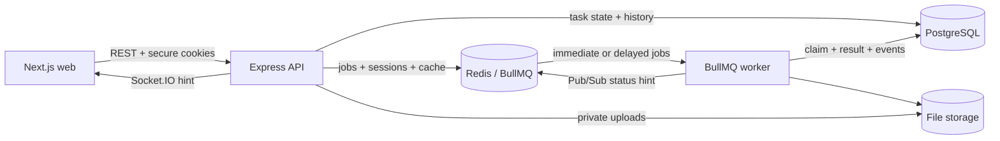

# TaskForge

TaskForge is a multi-user platform for creating, scheduling, processing, and tracking asynchronous tasks.

## Project Overview

Long-running work does not belong inside an HTTP request. TaskForge accepts work quickly, stores it durably, processes it in a separate worker, and keeps users informed through status, history, results, and live updates.

The current product includes:

- registration, login, rotating refresh sessions, and `USER`/`ADMIN` roles;
- user and admin dashboards with durable task and queue counts;
- immediate and one-time scheduled tasks;
- search, filters, sorting, pagination, editing, soft deletion, history, and retry;
- `TEXT_PROCESSING` and private `FILE_INSPECTION` jobs;
- bounded retries, duplicate-delivery protection, and queue reconciliation;
- authenticated Socket.IO status hints with API refetch;
- Swagger/OpenAPI, Postman, tests, CI, and Docker Compose.

Task lifecycle:

```text
PENDING -> PROCESSING -> COMPLETED
              \-----> FAILED -> manual retry -> PENDING
```

The worker is required for execution. Without it, accepted tasks remain pending.

## Tech Stack

| Layer          | Technology                                                                       |
| -------------- | -------------------------------------------------------------------------------- |
| Web            | Next.js 16, React 19, TypeScript, TanStack Query, Redux Toolkit, React Hook Form |
| API            | Node.js 24, Express 5, Zod, Socket.IO, Swagger/OpenAPI                           |
| Data           | PostgreSQL 18, Prisma 7                                                          |
| Jobs and Redis | BullMQ 6, Redis 7.2                                                              |
| Security       | Argon2id, HttpOnly JWT cookies, rotating Redis sessions, CSRF, CORS, RBAC        |
| Quality        | Jest, Supertest, React Testing Library, Prettier, ESLint, GitHub Actions         |
| Runtime        | pnpm workspaces, Docker, Docker Compose                                          |

## Architecture Diagram



Core rules:

- Express accepts and dispatches work; it never executes jobs inline.
- PostgreSQL is the source of truth for user-visible state and append-only history.
- Redis owns queue mechanics and other temporary coordination state.
- Deterministic job IDs, execution versions, and conditional database updates make duplicate delivery safe.

See [Architecture](docs/architecture.md) for processing, retry, and consistency details.

## Folder Structure

```text
Taskforge/
├── apps/
│   ├── api/
│   │   ├── prisma/             # schema, migrations, deterministic seed
│   │   └── src/                # API, worker, modules, infrastructure, OpenAPI
│   └── web/src/                # Next.js app, components, API client, providers, store
├── packages/contracts/         # shared Zod contracts and public enums
├── docs/                       # focused product and technical references
├── postman/                    # API smoke collection
├── .github/workflows/          # CI checks
├── docker-compose.yml
└── .env.example
```

## Installation Steps

### Prerequisites

- Git
- Docker Desktop with Docker Compose
- Node.js `24.18.1` (`.node-version` is committed)
- pnpm `10.12.1`

A version manager such as `fnm` or `nvm` can select Node 24 for this repository without changing the global Node version.

### 1. Clone and install

```bash
git clone https://github.com/maadhav6677/Taskforge.git
cd Taskforge
fnm install 24.18.1
fnm use 24.18.1
corepack enable
corepack prepare pnpm@10.12.1 --activate
pnpm install --frozen-lockfile
cp .env.example .env
```

Run all remaining commands from the repository root.

### 2. Start PostgreSQL and Redis

```bash
docker compose up -d postgres redis
docker compose ps
```

Wait until `taskforge-postgres` is healthy.

### 3. Prepare the database

```bash
pnpm db:generate
pnpm db:migrate
pnpm db:seed
```

### 4. Start the application

Run each command in a separate terminal:

```bash
# API — http://localhost:4000
pnpm --filter @taskforge/api start:dev
```

```bash
# Worker
pnpm --filter @taskforge/api start:worker:dev
```

```bash
# Web — http://localhost:3000
pnpm start:web
```

Useful URLs:

| Resource        | URL                                         |
| --------------- | ------------------------------------------- |
| Web application | <http://localhost:3000>                     |
| Swagger UI      | <http://localhost:4000/api/v1/docs>         |
| OpenAPI JSON    | <http://localhost:4000/api/v1/openapi.json> |
| Liveness        | <http://localhost:4000/api/v1/health/live>  |
| Readiness       | <http://localhost:4000/api/v1/health/ready> |

Seeded accounts use password `TaskForge123!`:

- `user@taskforge.local` — user workspace and sample tasks;
- `admin@taskforge.local` — read-only system dashboard and task list.

### Full Docker stack

The production runtime images do not contain the Prisma migration CLI, so prepare the database from the host before starting every container:

```bash
docker compose up -d postgres redis
pnpm db:generate
pnpm db:migrate
pnpm db:seed
docker compose up --build -d api worker web
docker compose ps
```

Follow logs with `docker compose logs -f api worker web` and stop with `docker compose down`. Named volumes preserve database, Redis, and container upload data.

## Environment Variables

Copy `.env.example` to `.env`. The example values are for local development only.

| Group            | Variables                                                                 | Purpose                                     |
| ---------------- | ------------------------------------------------------------------------- | ------------------------------------------- |
| Runtime          | `NODE_ENV`, `LOG_LEVEL`, `REQUEST_ID_HEADER`                              | Runtime mode, logging, request correlation  |
| API              | `API_PORT`, `API_BASE_PATH`, `API_CORS_ORIGINS`                           | API address and allowed browser origins     |
| Request limits   | `API_MAX_JSON_BYTES`, `API_BODY_BYTES`, `API_RATE_LIMIT_WINDOW_MS`        | JSON, multipart, and rate-limit bounds      |
| JWT              | `JWT_ACCESS_SECRET`, `JWT_REFRESH_SECRET`, `JWT_ISSUER`, `JWT_AUDIENCE`   | Token signing and validation                |
| Session lifetime | `JWT_ACCESS_TTL`, `JWT_REFRESH_TTL`, `REFRESH_ROTATION_REDIS_TTL_SECONDS` | Access and refresh expiry                   |
| Cookies/CSRF     | `COOKIE_SECURE`, `CSRF_HEADER`                                            | Cookie transport and mutation protection    |
| PostgreSQL       | `DATABASE_URL`, `DATABASE_URL_TEST`, `TASKFORGE_POSTGRES_PORT`            | Application/test databases and Compose port |
| Redis            | `REDIS_URL`, `REDIS_URL_TEST`, `TASKFORGE_REDIS_PORT`                     | Application/test Redis and Compose port     |
| Web              | `WEB_PORT`, `NEXT_PUBLIC_API_ORIGIN`, `NEXT_PUBLIC_API_BASE_PATH`         | Browser runtime and API location            |
| Files            | `TASK_FILE_STORAGE_PATH`, `TASK_MAX_FILE_SIZE_BYTES`, `TASK_MAX_FILES`    | Private storage and upload limits           |

Use new secrets, `COOKIE_SECURE=true`, HTTPS, managed data services, and secret management outside local development. Never point `DATABASE_URL_TEST` at shared data; the integration runner recreates databases ending in `_test`.

## API Documentation

The API base path is `/api/v1`. Swagger UI and the OpenAPI document are served by the running API. A secret-free Postman collection is available at [`postman/TaskForge.postman_collection.json`](postman/TaskForge.postman_collection.json).

| Area           | Endpoints                                                                                                              |
| -------------- | ---------------------------------------------------------------------------------------------------------------------- |
| Authentication | `GET /auth/csrf`, `POST /auth/register`, `POST /auth/login`, `POST /auth/refresh`, `POST /auth/logout`, `GET /auth/me` |
| User dashboard | `GET /dashboard/summary`                                                                                               |
| Tasks          | `POST /tasks`, `GET /tasks`, `GET/PATCH/DELETE /tasks/:id`, `POST /tasks/:id/retry`, `GET /tasks/:id/history`          |
| Files          | `GET /files/:id/download`                                                                                              |
| Admin          | `GET /admin/dashboard/summary`, `GET /admin/tasks`                                                                     |
| Operations     | `GET /health/live`, `GET /health/ready`, `GET /docs`, `GET /openapi.json`                                              |

Authentication uses HttpOnly cookies. State-changing requests also require an allowed `Origin` and matching CSRF cookie/header. Task update, delete, and retry use `If-Match` for optimistic concurrency.

See [API Contract](docs/api.md) for envelopes, status codes, list parameters, and realtime events.

## Assumptions Made

- Tasks are independent; recurring schedules, priorities, and task dependencies are outside the current scope.
- Scheduling is one-time. A future task remains `PENDING` until the worker can claim it.
- BullMQ delivery is at-least-once, so database claims—not queue delivery alone—protect execution.
- The initial admin is seeded and read-only; public registration creates only `USER` accounts.
- Local private storage and one Redis instance are acceptable for the local runtime.
- PostgreSQL remains available as the durable source of truth even when cache or live updates fail.
- The web application and API run on configured trusted origins for cookie authentication.

## Trade-offs

| Choice                                              | Benefit                                                         | Cost / limitation                                                   |
| --------------------------------------------------- | --------------------------------------------------------------- | ------------------------------------------------------------------- |
| Modular monolith with separate API/worker processes | Simple code ownership with independent worker execution         | Not independently deployable business services                      |
| PostgreSQL as product truth                         | Transactions, constraints, indexed history, reliable aggregates | Queue dispatch needs reconciliation across PostgreSQL and Redis     |
| Task row as dispatch ledger                         | Small, recoverable design for current workflows                 | A transactional outbox may be better for many external side effects |
| Local private file storage                          | Simple development and shared API/worker access                 | Requires object storage and scanning for multi-host production      |
| Offset pagination                                   | Clear page controls and arbitrary sorting                       | Cursor pagination scales better for very large datasets             |
| One Redis service locally                           | Easy setup                                                      | Queue and cache/session workloads should be isolated in production  |
| HttpOnly cookies with CSRF protection               | Tokens stay out of browser storage                              | Requires correct origin, cookie, and HTTPS configuration            |

## Future Improvements

- Add Playwright coverage for login, task execution, retry, files, and ownership boundaries.
- Move uploads to private object storage with scanning, retention, and signed delivery.
- Split queue Redis from session/cache Redis in production.
- Add metrics, tracing, error reporting, dashboards, and alerts.
- Add email verification, password recovery, MFA, and session management.
- Add cursor pagination, recurring tasks, priorities, and task dependencies when product demand justifies them.
- Deploy only after PostgreSQL, Redis, storage, secrets, TLS, backups, and monitoring are production-ready.

## Testing

```bash
pnpm ci:check                       # generate, lint, format, typecheck, test, build
pnpm test:integration:postgres      # real PostgreSQL, Redis, and BullMQ tests
pnpm docker:check                   # validate Compose and build images
```

## Further Documentation

- [Product Requirements](docs/requirements.md)
- [Architecture](docs/architecture.md)
- [API Contract](docs/api.md)
- [Database Design](docs/database.md)
- [Security Design](docs/security.md)
- [Contributor and Coding-Agent Guide](AGENTS.md)
