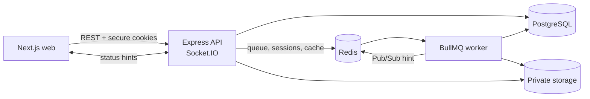
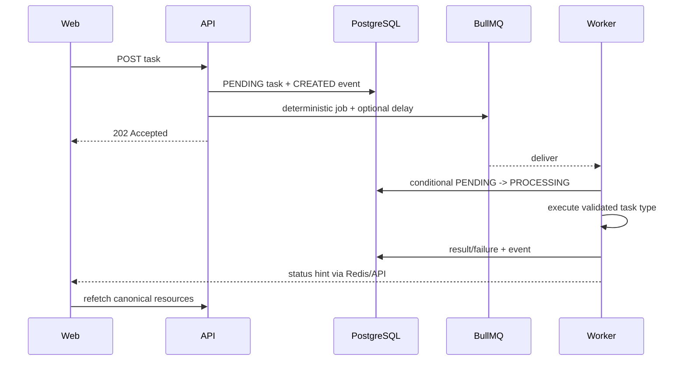

# Architecture

**Status:** Accepted baseline

## Style

TaskForge is a modular monolith with two backend runtimes from the same application package:

1. Express API for REST, auth, uploads, dashboard reads, and Socket.IO.
2. BullMQ worker for dispatch reconciliation and task execution.

This provides the justified process/scaling boundary without premature business microservices.



## Responsibilities

| Runtime/service | Owns |
| --- | --- |
| Next.js | Routes, accessible responsive UI, TanStack Query, narrow Redux state |
| Express | Validation, auth/policies, use cases, persistence, dispatch, files, OpenAPI |
| Worker | Reconciliation, claim, executor, attempt/result/event updates, invalidation |
| PostgreSQL | Users, task snapshot/history, results, attachment metadata |
| Redis | BullMQ, refresh sessions, rate limits, bounded cache, ephemeral Pub/Sub |
| Storage | Private attachment bytes behind a replaceable adapter |

Next.js route handlers/server actions do not become a second business API. Redis caches and status events never replace PostgreSQL state.

## Backend modules

- `auth`: credentials, tokens, sessions, revocation, auth middleware.
- `users`: durable identity and admin-safe reads.
- `tasks`: lifecycle policy, ownership, queries, history, retry, dispatch boundary.
- `files`: validation, storage, metadata, cleanup, authorized download.
- `dashboard`: scoped aggregates and cache policy.
- `workers`: claim/finalization wrapper, executors, error classification, reconciliation.

Controllers translate HTTP, services implement use cases, concrete repositories own persistence, and executors perform task work. See [coding-style.md](coding-style.md).

## Planned repository

```text
apps/
├── web/src/{app,features,components,lib,store}
└── api/
    ├── prisma/{schema,migrations,seed}
    └── src/{bootstrap,common,config,infra,modules,workers}
packages/
└── contracts/                       # Zod wire contracts and shared enums
docs/
.github/workflows/
AGENTS.md
docker-compose.yml
pnpm-workspace.yaml
```

Feature-private code stays in its feature. Code becomes shared only after real reuse. Shared contracts never expose Prisma/BullMQ models.

## Task lifecycle

The authoritative lifecycle rules are in [requirements.md](requirements.md).

```mermaid
stateDiagram-v2
    [*] --> PENDING: create/schedule
    PENDING --> PROCESSING: current worker claims
    PROCESSING --> COMPLETED: success
    PROCESSING --> PENDING: transient failure; attempts remain
    PROCESSING --> FAILED: permanent/exhausted
    FAILED --> PENDING: manual retry/new execution
```



One transition policy governs API and worker changes. A future execution is pending with `scheduledAt` metadata.

## Queue reliability

BullMQ can deliver at least once during failures:

- Job ID is deterministic from task ID and execution version.
- Worker claim conditionally changes only the matching pending, non-deleted execution.
- Zero changed rows means stale/ineligible work; the executor does not run.
- Finalization requires the same execution version and processing state.
- Manual retry/reschedule increments execution version.

PostgreSQL and Redis cannot share a transaction. The task row is the initial dispatch ledger:

1. Commit pending task and event.
2. Add deterministic BullMQ job, with delay if scheduled.
3. Record dispatch metadata.
4. If dispatch fails, keep the pending row undispatched.
5. Worker startup/periodic reconciliation safely re-adds current undispatched work.

A full outbox is deferred until multiple downstream events or irreversible integrations justify it.

## Request-to-worker flow



## Frontend state ownership

| State | Owner |
| --- | --- |
| API resources and mutations | TanStack Query |
| Search/filter/sort/page | URL parameters |
| Auth presentation/global UI | Redux Toolkit |
| Form/dialog interaction | React Hook Form/local state |

Socket.IO carries minimal invalidation hints; reconnect/focus refetch repairs missed events.

## Caching and Redis

Initial caches are scoped dashboard aggregates and hot task details with short TTLs. Task-list permutations are not cached initially. Mutations and worker transitions invalidate relevant user/admin/task keys.

Compose uses one namespaced, AOF-enabled, `noeviction` Redis service with separate queue, request, publisher, and subscriber connections. Production should isolate queue Redis from cache/session workloads.

## Files

Initial private local storage is shared only by API and worker containers. The API writes and authorizes downloads; workers read attachments. Opaque keys prevent user filenames becoming paths. S3-compatible storage is a later adapter, not a use-case rewrite.

## Runtime topology

Compose will run `web`, `api`, `worker`, `postgres`, and `redis`, plus named data/upload volumes. Images use pinned deterministic installs, multi-stage builds, non-root users, health checks, and graceful termination. Migrations run explicitly once rather than from every replica.

Operational requirements:

- `/health/live` for process liveness.
- `/health/ready` for bounded PostgreSQL/Redis readiness.
- Pino logs with request/task/job/execution identifiers and redaction.
- Graceful HTTP, worker, Prisma, and Redis shutdown.

Persistence details are in [database.md](database.md), security in [security.md](security.md), and rationale in [decisions.md](decisions.md).
