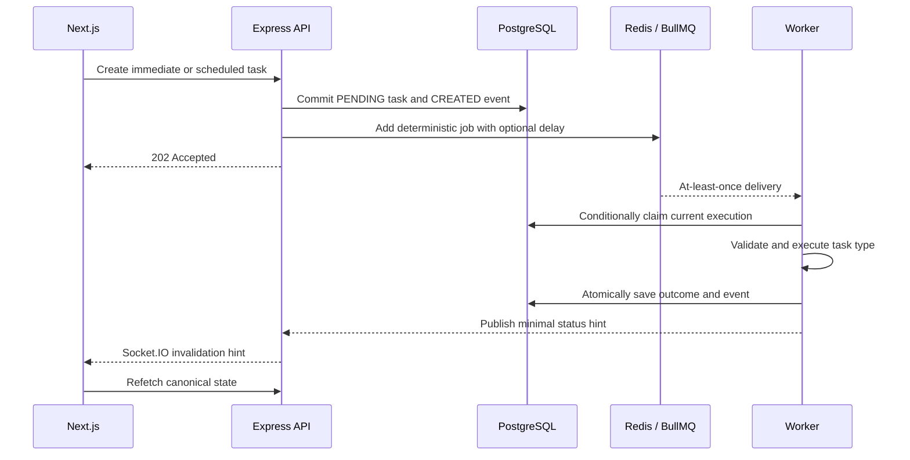

# Architecture

TaskForge is a modular monolith with separate API and worker processes. This document explains runtime ownership and reliability; [requirements.md](requirements.md) owns product rules, [database.md](database.md) persistence, and [security.md](security.md) trust boundaries.

## Runtime boundaries

| Component       | Responsibility                                                                                |
| --------------- | --------------------------------------------------------------------------------------------- |
| Next.js web     | Routes, responsive UI, forms, and client-side state coordination                              |
| Express API     | HTTP translation, validation, authentication, policy, use cases, files, dispatch, and OpenAPI |
| BullMQ worker   | Reconciliation, conditional task claims, execution, retries, and finalization                 |
| PostgreSQL      | Durable users, task snapshots, results, attachment metadata, and append-only history          |
| Redis           | BullMQ, refresh sessions, rate limits, short caches, and ephemeral status hints               |
| Private storage | Attachment bytes behind a replaceable storage adapter                                         |

Next.js does not implement a second business API. Redis and Socket.IO never replace PostgreSQL as product truth.

## System flow

If dispatch fails after the database commit, the task remains pending. Startup and periodic reconciliation safely add its current deterministic job later.

## Backend organization

The API package is divided by business capability:

- `auth`: credentials, JWTs, refresh sessions, CSRF, and auth middleware.
- `users`: durable identity and admin-safe user access.
- `tasks`: lifecycle policy, owned queries, history, retry, and dispatch.
- `files`: upload validation, private storage, metadata, and authorized download.
- `dashboard`: scoped aggregates and optional cache/queue context.
- `admin`: explicit read-only global views.
- worker modules: reconciliation, claims, executors, error classification, and finalization.

Routes translate HTTP, services implement use cases and policy, repositories own persistence, and executors perform validated task work. Shared Zod contracts describe wire data without exposing Prisma or BullMQ models.

## Reliability model

BullMQ delivery is at-least-once, and PostgreSQL cannot share a transaction with Redis. TaskForge therefore uses these safeguards:

1. The API commits the task snapshot and event before queue dispatch.
2. A job ID is derived from task ID and `executionVersion`.
3. The worker claims only a matching, pending, non-deleted execution.
4. Finalization requires the same execution version and processing state.
5. Automatic attempts remain inside one execution version; manual retry creates another.
6. `rowVersion` advances for every user-visible snapshot change and backs HTTP preconditions.
7. Reconciliation finds current pending work that lacks successful dispatch metadata.

A zero-row claim or finalization means the delivery is stale or no longer eligible; the executor does not run or overwrite newer state. The task row is sufficient as the current dispatch ledger. A full outbox is deferred until the product has multiple irreversible downstream integrations.

## Frontend state ownership

| State                                       | Owner                          |
| ------------------------------------------- | ------------------------------ |
| API resources and mutations                 | TanStack Query                 |
| Search, filters, sorting, and page          | URL parameters                 |
| Auth presentation and client-only global UI | Redux Toolkit                  |
| Forms and dialogs                           | React Hook Form or local state |

Socket.IO invalidates affected queries. Reconnect, focus, and bounded polling for selected active tasks repair missed events.

## Files and caching

The API validates file signatures, creates opaque storage keys, and authorizes every download. API and worker share private local storage in Compose; an object-storage adapter is the production path.

Only bounded, short-lived data such as dashboard aggregates is cached. Mutations and worker transitions invalidate relevant keys. Cache or Pub/Sub failure must not make durable task data incorrect.

## Deployment topology

Docker Compose runs `web`, `api`, `worker`, `postgres`, and `redis`. PostgreSQL, Redis, and uploads use named volumes; only the API and worker share attachment storage. Migrations run explicitly once instead of from every application replica.

The API exposes `/health/live` for process liveness and `/health/ready` for bounded PostgreSQL and Redis readiness checks. Processes use structured redacted logs and graceful shutdown.

## Key trade-offs

- **Modular monolith:** simpler transactions and local development, while API and worker still scale independently.
- **PostgreSQL-first consistency:** durable, explainable state at the cost of reconciliation between database and queue.
- **Local private storage:** keeps the prototype runnable but requires shared disk and is not horizontally scalable.
- **Socket hints plus refetch:** tolerates missed events, with extra reads compared with trusting event payloads.
- **One Redis service locally:** reduces setup; production should isolate queue workloads from cache/session pressure.
