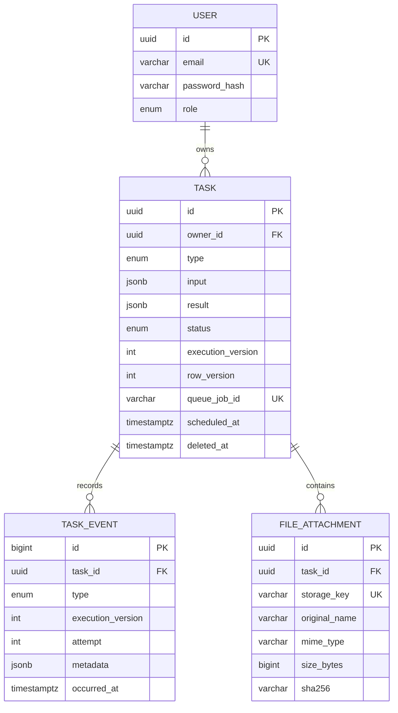

# Database design

PostgreSQL is authoritative for identity, task snapshots, results, attachment metadata, and history. This document records durable invariants; [requirements.md](requirements.md) owns lifecycle policy and [architecture.md](architecture.md) queue flow.

## Data model

## Invariants

### Users and tasks

- Emails are normalized and unique; passwords are stored only as Argon2id hashes.
- Public roles are `USER` and `ADMIN`; public task statuses are `PENDING`, `PROCESSING`, `COMPLETED`, and `FAILED`.
- Task input/result JSON must be objects and is validated again at service and worker boundaries.
- `execution_version` identifies the current logical execution and changes on reschedule/manual retry.
- `row_version` starts at 1 and changes for every user-visible snapshot or result update, including worker transitions. It backs HTTP `ETag` and `If-Match` behavior.
- Queue job IDs are nullable, unique, and deterministic for a task execution.
- Soft deletion uses `deleted_at`; stale queue work cannot claim a deleted task.
- Constraints bound titles, descriptions, attempts, file sizes, and compatible lifecycle/error timestamps.

### History and files

- `task_events` is append-only. A database trigger rejects update and delete; corrections are new events.
- Snapshot and event changes for one transition commit in the same transaction.
- History stores safe product facts, never secrets, raw files, paths, or stack traces.
- File names are display metadata only. Opaque unique storage keys identify bytes.
- File authorization joins through the task owner. File type and size come from server validation.

## Transaction boundaries

| Operation               | Atomic database work                                | Work after commit                |
| ----------------------- | --------------------------------------------------- | -------------------------------- |
| Create                  | Task, file metadata, and `CREATED` event            | Dispatch deterministic job       |
| Claim                   | Matching pending execution to processing plus event | Execute validated task           |
| Finalize/retry delay    | Matching snapshot and outcome event                 | Invalidate cache/publish hint    |
| Reschedule/manual retry | Version checks, reset fields, new execution/event   | Dispatch new job                 |
| Delete                  | Version/state check, soft delete, event             | Remove queued job where possible |

Conditional claims and finalization require the current execution and expected state. A zero-row result is treated as stale work. Browser mutations include the expected `row_version` in repository predicates.

## Query indexes

The committed migrations cover:

- unique normalized email, queue job ID, and storage key;
- owned default/status task lists;
- status/schedule reads and pending-undispatched reconciliation;
- task history ordering and attachment lookup;
- `pg_trgm` GIN indexes for case-insensitive title/description search.

New indexes require a real query and consideration of write and storage cost.

## Migrations and seed

- Use reviewed Prisma migrations; `db push` is not a delivery workflow.
- Run migrations once before application traffic, not from every replica.
- Custom extensions, checks, triggers, and indexes belong in committed SQL migrations.
- Destructive schema changes require an expand/migrate/contract plan.
- The deterministic, idempotent development seed creates a user, an admin, and representative task states without resetting tasks that a worker has progressed.

The initial history creates the schema/constraints/append-only trigger and then enables `pg_trgm` with search indexes.

## Verification

`pnpm test:integration:postgres` recreates only a configured `_test` database, applies committed migrations, runs the repository suite, and removes that test database. It covers constraints, seed idempotence, ownership, search/order, append-only history, optimistic conflicts, duplicate claims, lifecycle finalization, and early-schedule rejection.
