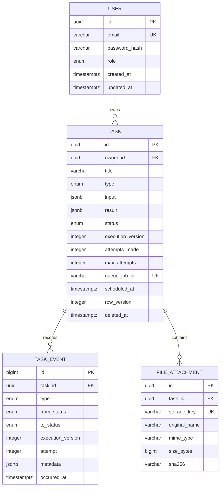

# Database design

**Status:** Proposed; migrations pending

PostgreSQL is authoritative for identity, task state/history, results, and attachment metadata. Redis/BullMQ state never becomes the only explanation for user-visible behavior.

## Model

## Enums

- Role: `USER`, `ADMIN`.
- Task type: `TEXT_PROCESSING`, `FILE_INSPECTION`.
- Status: `PENDING`, `PROCESSING`, `COMPLETED`, `FAILED`.
- Events initially cover created, updated/scheduled/dispatched, started, retry scheduled, completed, failed, manual retry, and deleted.

Events are product concepts, not raw BullMQ event names.

## Table invariants

### `users`

- UUID primary key.
- Trimmed/lowercased unique email.
- Argon2id password hash; never serialized/logged.
- Role defaults to `USER`.
- UTC timestamps.

### `tasks`

- Required owner, bounded title/description, task type, and validated versioned JSONB input.
- Nullable validated result and sanitized public error code/message.
- `execution_version` starts at 1 and increments when replacing current execution through reschedule/manual retry.
- `attempts_made >= 0`; bounded positive `max_attempts`, default 3.
- Nullable unique deterministic `queue_job_id`, plus dispatch/lifecycle timestamps.
- `row_version >= 1` increments on accepted browser-facing mutation.
- Nullable `deleted_at` provides soft deletion.

Searchable lifecycle data remains in columns; JSONB is limited to type-specific versioned input/result.

### `task_events`

- Append-only, bigint ordered ID, required task/execution version.
- Records type, optional status transition, attempt, small safe metadata, and UTC occurrence.
- Never stores secrets, raw files, or stack traces.

### `file_attachments`

- Belongs to one task; authorization joins through task owner.
- Original name is display-only; opaque unique storage key is the path identity.
- Server-detected MIME, positive bounded size, and nullable inspection checksum.

## Constraints and indexes

Migrations enforce unique email/storage/queue identifiers, positive versions/attempt bounds/file size, enum validity, and required foreign keys.

Initial query-driven indexes:

| Index | Query |
| --- | --- |
| unique `users(email)` | Registration/login |
| `tasks(owner_id, deleted_at, created_at DESC, id)` | Default owned list |
| `tasks(owner_id, status, created_at DESC, id)` | Status filter/drill-down |
| `tasks(status, scheduled_at)` | Pending reconciliation |
| unique nullable `tasks(queue_job_id)` | Job correlation |
| `task_events(task_id, occurred_at DESC, id DESC)` | History |
| `file_attachments(task_id)` | Detail/download authorization |
| trigram GIN on title/description | Case-insensitive search |

`pg_trgm` and custom indexes live in reviewed migration SQL. New indexes require a demonstrated query and consideration of write/storage cost.

## Transaction boundaries

- **Create:** task, attachment metadata, and `CREATED` event commit together; file/database failure uses compensation. Queue dispatch occurs after commit.
- **Claim:** conditional update requires matching task ID, execution version, pending state, and non-deleted row; zero rows means do not execute.
- **Finalize/retry delay:** snapshot and event change together, requiring the matching processing execution.
- **Reschedule/manual retry:** check expected row/lifecycle, increment execution and row versions, reset execution fields, append event; dispatch after commit.
- **Delete:** check version/state, soft-delete and append event; stale queue delivery remains harmless because claim excludes deleted rows.

The product transition policy is authoritative in [requirements.md](requirements.md).

## Concurrency and dispatch

Browser mutations use returned task `version` through `If-Match`; repository writes include the expected `row_version`. Workers use `execution_version` to reject stale jobs.

Reconciliation reads bounded batches of current pending undispatched rows, adds deterministic jobs with remaining delay, and conditionally records dispatch. BullMQ job uniqueness and worker claim are separate duplicate guards. See [architecture.md](architecture.md).

## Migrations and seed

- Use Prisma Migrate and review generated SQL before commit.
- Custom extensions/constraints/indexes are migrations, never undocumented manual steps.
- `db push` is not the deployment path.
- Run production/Compose migrations explicitly once before traffic.
- Future destructive changes require an expand/migrate/contract plan.

Seed data is deterministic/idempotent and includes one development user, one admin, and representative pending/scheduled/completed/failed tasks with consistent history. Production does not seed automatically.

## Required integration tests

Use real PostgreSQL for migration-from-empty, seed consistency, email uniqueness, ownership, list/search ordering, append-only history, soft deletion, optimistic conflicts, and conditional claim/finalization.
