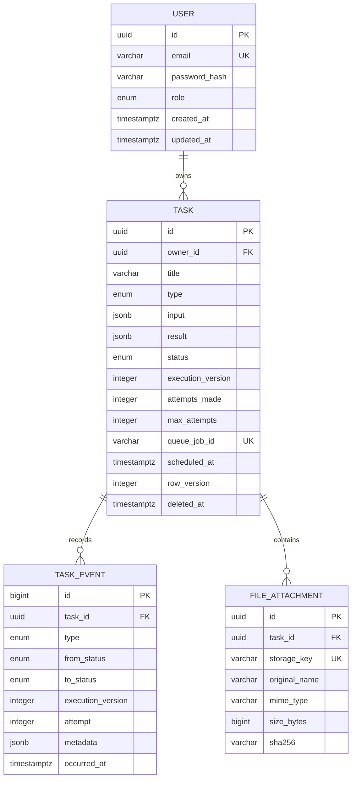

# Database design

**Status:** Current persistence model and lifecycle invariants

## Purpose and ownership

This document defines durable data ownership, schema invariants, indexes, transaction boundaries, migration policy, seed behavior, and infrastructure-backed verification. Update it with every schema, constraint, index, migration, seed, or transaction-boundary change.

PostgreSQL is authoritative for identity, task state/history, results, and attachment metadata. Redis/BullMQ state never becomes the only explanation for user-visible behavior.

## Model

## Enums

- Role: `USER`, `ADMIN`.
- Task type: `TEXT_PROCESSING`, `FILE_INSPECTION`.
- Status: `PENDING`, `PROCESSING`, `COMPLETED`, `FAILED`.
- Events initially cover created, updated/scheduled/dispatched, started, retry scheduled, completed, failed, manual retry, and deleted.

Events are product concepts, not raw BullMQ event names.

## Table invariants

### `users`

- UUID primary key.
- Trimmed/lowercased unique email.
- Argon2id password hash; never serialized/logged.
- Role defaults to `USER`.
- UTC timestamps.

### `tasks`

- Required owner, bounded title/description, task type, and validated versioned JSONB input.
- Nullable validated result and sanitized public error code/message.
- `execution_version` starts at 1 and increments when replacing current execution through reschedule/manual retry.
- `attempts_made >= 0`; bounded positive `max_attempts`, default 3.
- Nullable unique deterministic `queue_job_id`, plus dispatch/lifecycle timestamps.
- `row_version >= 1` increments whenever the user-visible task state or result changes, including
  worker lifecycle transitions. It supports browser mutation preconditions and the task-detail
  HTTP `ETag`.
- Nullable `deleted_at` provides soft deletion.

The migration bounds titles to 160 characters, descriptions to 2,000 characters, attempts to
1–10, and requires input/result JSON to be objects. Named checks also keep error/dispatch fields
paired, reject impossible lifecycle timestamp ordering, and require each status snapshot to have
the appropriate result, error, and timestamps.

Searchable lifecycle data remains in columns; JSONB is limited to type-specific versioned input/result.

### `task_events`

- Append-only, bigint ordered ID, required task/execution version.
- Records type, optional status transition, attempt, small safe metadata, and UTC occurrence.
- Never stores secrets, raw files, or stack traces.
- A PostgreSQL trigger rejects `UPDATE` and `DELETE`; corrections append a new event.

### `file_attachments`

- Belongs to one task; authorization joins through task owner.
- Original name is display-only; opaque unique storage key is the path identity.
- Server-detected MIME, positive bounded size, and nullable inspection checksum.
- The initial database bound is 8 MiB and SHA-256 values must be lowercase 64-character hex.
  The cross-row maximum attachment count remains a service transaction rule because a
  row `CHECK` constraint cannot safely count sibling records.

## Constraints and indexes

Migrations enforce unique email/storage/queue identifiers, positive versions/attempt bounds/file size, enum validity, and required foreign keys.

Initial query-driven indexes:

| Index                                              | Query                         |
| -------------------------------------------------- | ----------------------------- |
| unique `users(email)`                              | Registration/login            |
| `tasks(owner_id, deleted_at, created_at DESC, id)` | Default owned list            |
| `tasks(owner_id, status, created_at DESC, id)`     | Status filter/drill-down      |
| `tasks(status, scheduled_at)`                      | Status/schedule reads         |
| partial `tasks(scheduled_at, id)`                  | Undispatched reconciliation   |
| unique nullable `tasks(queue_job_id)`              | Job correlation               |
| `task_events(task_id, occurred_at DESC, id DESC)`  | History                       |
| `file_attachments(task_id)`                        | Detail/download authorization |
| separate trigram GIN on title and description      | Case-insensitive search       |

`pg_trgm` is enabled in its own reviewed migration and backs two GIN indexes used by Prisma's
case-insensitive title/description search. The partial reconciliation index and append-only
trigger also live in reviewed SQL because Prisma schema syntax cannot represent them. New indexes
require a demonstrated query and consideration of write/storage cost.

## Transaction boundaries

- **Create:** task, attachment metadata, and `CREATED` event commit together; file/database failure uses compensation. Queue dispatch occurs after commit.
- **Claim:** conditional update requires matching task ID, execution version, pending state, and non-deleted row; zero rows means do not execute. The changed snapshot advances its row version.
- **Finalize/retry delay:** snapshot and event change together, requiring the matching processing execution and advancing the row version.
- **Reschedule/manual retry:** check expected row/lifecycle, increment execution and row versions, reset execution fields, append event; dispatch after commit.
- **Delete:** check version/state, soft-delete and append event; stale queue delivery remains harmless because claim excludes deleted rows.

The product transition policy is authoritative in [requirements.md](requirements.md).

## Concurrency and dispatch

Browser mutations use the returned task `version` or task-detail `ETag` through `If-Match`; repository writes include the expected `row_version`. The task-detail `ETag` incorporates this version and the snapshot's last-modified timestamp, so every durable snapshot change invalidates a browser-cached detail, including existing rows that predate the versioning policy. Workers use `execution_version` to reject stale jobs.

Reconciliation reads bounded batches of current pending undispatched rows, adds deterministic jobs with remaining delay, and conditionally records dispatch. BullMQ job uniqueness and worker claim are separate duplicate guards. See [architecture.md](architecture.md).

## Migrations and seed

- Use Prisma Migrate and review generated SQL before commit.
- Custom extensions/constraints/indexes are migrations, never undocumented manual steps.
- `db push` is not the deployment path.
- Run production/Compose migrations explicitly once before traffic.
- Destructive changes require an expand/migrate/contract plan.

Seed data is deterministic/idempotent and includes one development user, one admin, and representative pending/scheduled/completed/failed tasks with consistent history. Production does not seed automatically.

The committed initial migration history is deliberately split:

1. `20260802130000_initial_schema` creates enums, tables, foreign keys, named constraints,
   query-driven indexes, and the append-only history trigger.
2. `20260802130100_pg_trgm_search` explicitly enables `pg_trgm` and creates the search indexes.

`pnpm db:migrate` uses `prisma migrate deploy`; `db push` is not part of the workflow. The seed uses
fixed UUIDs and timestamps, creates the two users and four task snapshots only when absent, and
inserts missing history events without mutating existing history. Running it repeatedly never
resets a task that a worker has already progressed; a completed fixture therefore remains
consistent with its retained history rather than being restored to `PENDING`.

## Integration verification

Use real PostgreSQL for migration-from-empty, seed consistency, email uniqueness, ownership, list/search ordering, append-only history, soft deletion, optimistic conflicts, and conditional claim/finalization.

`pnpm test:integration:postgres` implements the lifecycle. It validates that the configured name
ends in `_test`, recreates that database, applies committed migrations, runs the serial repository
suite, and drops only the test database in cleanup. The suite currently proves migration/extension
state, named constraints, seed idempotence, snapshot/history agreement, ownership isolation,
case-insensitive search, append-only history, optimistic updates, duplicate claims, finalization,
and rejection of early scheduled work.
