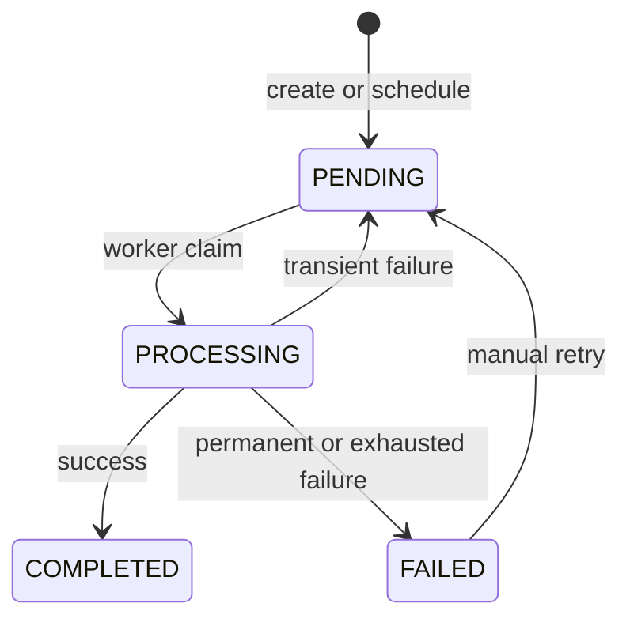

# Product requirements

This document defines what TaskForge supports and the rules users can rely on. See [architecture.md](architecture.md) for runtime design and [api.md](api.md) for the HTTP contract.

## Product goal

TaskForge lets authenticated users create immediate or scheduled tasks, track their progress, inspect results and history, and retry eligible failures. Work runs asynchronously so API requests remain responsive and task state survives process restarts or temporary queue failures.

## Actors

- **User:** manages only their own tasks, history, dashboard data, and files.
- **Admin:** has explicit read-only system-wide task and dashboard views. Public registration cannot create admins.
- **Worker:** claims eligible tasks and records their outcome; it is not a human-facing actor.

## Supported capabilities

### Accounts and access

- Register, sign in, restore/refresh a session, and sign out.
- Enforce `USER` and `ADMIN` roles plus task ownership on the server.
- Conceal another user's resource behind the same response used for a missing resource.

### Tasks

- Create, view, search, filter, sort, paginate, update, soft-delete, schedule, and inspect history.
- Run `TEXT_PROCESSING` tasks for allowlisted text operations.
- Run `FILE_INSPECTION` tasks for verified JPEG, PNG, WebP, and PDF attachments.
- Show `PENDING`, `PROCESSING`, `COMPLETED`, and `FAILED` as the only public statuses.
- Provide scoped dashboard totals plus available queue context.

### Execution and recovery

- Persist a task before dispatching it to BullMQ; HTTP requests never execute task work inline.
- Retry transient worker failures automatically with bounded exponential backoff.
- Reject stale or duplicate queue deliveries without repeating the current execution.
- Redispatch durable pending work after a temporary queue failure.
- Treat live events as refresh hints and refetch canonical state from the API.

## Lifecycle rules

- A future task remains `PENDING`; `scheduledAt` records when it becomes eligible.
- Only `PENDING` tasks may change input, attachments, or schedule.
- A `PROCESSING` task cannot be updated or deleted because cancellation is not guaranteed.
- Manual retry is allowed only from `FAILED` and starts a new execution version.
- Update, delete, and retry require the latest task version through `If-Match`.
- Every meaningful transition updates the durable snapshot and append-only history together.
- Task results and public errors must be safe to display; internal stacks and paths are never exposed.

## Product invariants

- PostgreSQL is the source of truth for users, task state, results, attachment metadata, and history.
- Redis owns queue mechanics, refresh sessions, rate limits, caches, and Pub/Sub hints—not durable product state.
- Backend policies and owner-scoped database predicates enforce access; frontend guards are presentation only.
- Uploaded bytes remain private and every download is authorized through the owning task.
- Queue delivery is at-least-once, so execution must remain idempotent at the task boundary.
- Search, filters, sorting, and pagination are shareable through URL parameters.

## Non-goals

The current product does not provide arbitrary code or URL execution, recurring schedules, task dependencies, priorities, cancellation, organizations, billing, social login, MFA, password recovery, public file hosting, microservices, or Kubernetes.

These are deliberate scope limits, not hidden implemented features. Moving one into scope requires matching behavior, security, persistence, API, tests, and documentation.
