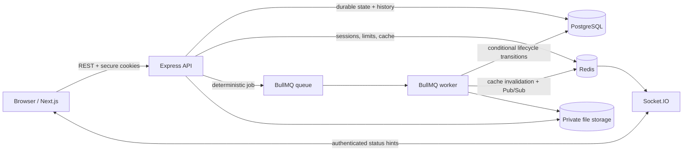
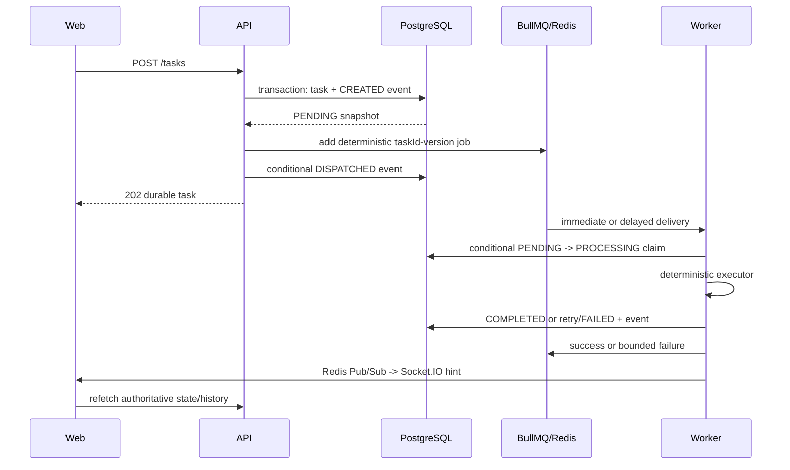

# TaskForge high-level and low-level design

**Status:** Current implementation map; production extensions remain explicit

## Purpose and ownership

This document maps the current implementation for engineers and coding agents: runtime components, primary flows, module responsibilities, concurrency algorithms, failure behavior, and verification boundaries. Update it when implemented components or algorithms change.

Product rules remain authoritative in [requirements.md](requirements.md), wire contracts in [api.md](api.md), persistence in [database.md](database.md), and security controls in [security.md](security.md).

## High-level design (HLD)

### System objective

TaskForge accepts authenticated immediate or scheduled work, stores its user-visible state and append-only history durably, executes only in a separate worker, and presents lifecycle state through a responsive web application. The modular monolith keeps one deployable codebase without merging runtime responsibilities.



### Runtime boundaries

| Runtime         | Owns                                                                                           | Must not do                                  |
| --------------- | ---------------------------------------------------------------------------------------------- | -------------------------------------------- |
| Next.js web     | Presentation, forms, URL list controls, query invalidation, client-only UI state               | Authorize data or persist access tokens      |
| Express API     | HTTP translation, validation, auth policy, use-case orchestration, persistence and dispatch    | Execute task work inline                     |
| BullMQ worker   | Job validation, conditional claim, deterministic executors, retry/finalization, reconciliation | Treat queue state as durable product truth   |
| PostgreSQL      | Users, task snapshots, attachments, append-only events, concurrency constraints                | Store ephemeral sessions or attempt timers   |
| Redis           | BullMQ mechanics, rotating sessions, rate buckets, bounded cache, Pub/Sub hints                | Become the source of user-visible task truth |
| Private storage | Opaque attachment bytes                                                                        | Serve a public directory or trust filenames  |

### Primary flows

#### Authentication

1. Browser obtains a random CSRF cookie.
2. Registration/login verifies input and Argon2id credentials.
3. API creates a Redis refresh family and sets short-lived access, narrow-path refresh, and readable CSRF cookies.
4. Mutations require an allowlisted `Origin` and matching CSRF cookie/header.
5. Refresh atomically replaces the opaque credential; reuse revokes the family.
6. Express verifies JWT algorithm, issuer, audience, expiry, role, subject, and session identifier before policy checks.

#### Task execution



The API can return a durable `PENDING` task even if dispatch temporarily fails. The worker reconciliation loop finds undispatched tasks. Repeated dispatch is harmless because job IDs and database claims include the execution version.

#### Private files

Multipart bytes stay in bounded memory, then magic bytes are checked against JPEG/PNG/WebP/PDF. The API writes an opaque key outside public roots and records metadata only after validation. Downloads apply the owner predicate before reading. The worker recomputes SHA-256 from stored bytes and persists inspection results.

### Deployment model

One Compose project builds three production images: web, API, and worker. API and worker share compiled domain code but run separate entry points. PostgreSQL, Redis, and the uploads volume are private dependencies in production; only web/API require public ingress. Horizontal API replicas are stateless apart from external stores. Worker concurrency is independently adjustable.

### Reliability and security model

- PostgreSQL conditional updates make duplicate/stale jobs safe.
- Append-only triggers protect event auditability beneath application code.
- Redis loss invalidates refresh sessions; ordinary database reads can bypass failed cache.
- Queue dispatch is reconciled; WebSocket delivery is only an invalidation hint.
- Ownership lives in repository predicates and explicit admin routes.
- Logs and errors expose stable codes/request IDs, never credentials, stacks, storage paths, or dependency internals.
- Upload types, sizes, counts, names, and storage keys are bounded independently.

## Low-level design (LLD)

### Repository layout

```text
apps/
  api/
    prisma/                 schema, reviewed SQL migrations, deterministic seed
    src/bootstrap/          API and worker composition roots
    src/infrastructure/     database, Redis, queue, cache, realtime, logging
    src/modules/            auth, users, tasks, files, dashboard, admin, health
    src/openapi/            machine-readable REST description
    tests/                  unit, HTTP, PostgreSQL/Redis/BullMQ integration
  web/src/
    app/                    Next.js composition and global styles
    components/             auth, user workspace, admin workspace
    lib/                    credentialed API client and presentation types
    providers/              Query and Redux providers
    store/                  client-only UI slice
packages/contracts/         runtime-safe cross-workspace contracts
postman/                    secret-free smoke collection
docs/                       authoritative engineering documentation
```

### Backend module responsibilities

| Component                      | Responsibility                                                                 |
| ------------------------------ | ------------------------------------------------------------------------------ |
| `AuthService`                  | Registration/login use cases; never handles HTTP cookies directly              |
| `RefreshSessionStore`          | Opaque token material, HMAC hashes, atomic rotation, family revocation         |
| `authenticate` / `requireRole` | Access claims and route policy                                                 |
| `TaskService`                  | Lifecycle preconditions, optimistic version policy, dispatch orchestration     |
| `TaskRepository`               | Owner-scoped Prisma queries and atomic snapshot/event transitions              |
| `TaskDispatcher`               | Deterministic BullMQ add/remove and reconciliation                             |
| task worker                    | Runtime job validation, conditional claim, executor choice, retry/final result |
| `FileStorage`                  | Magic-byte verification and opaque private byte operations                     |
| `FileRepository`               | Attachment metadata and owner-scoped lookup                                    |
| `TaskSummaryCache`             | Ten-second bounded task-count cache with database fallback                     |
| Socket bridge                  | Verified-cookie rooms and sanitized invalidation events                        |

Controllers/routes translate HTTP only: Zod input, service call, status/header/envelope. Services own use cases. Repositories own persistence. Executors accept validated persisted input and return JSON-safe results.

### Data and concurrency details

- `tasks.row_version` backs `If-Match` and contributes to the task-detail `ETag` alongside the snapshot's last-modified timestamp. Every durable task state or result change, including worker transitions, advances it; update/delete/retry also use owner, ID, expected version, allowed status, and `deleted_at IS NULL` in one predicate.
- `execution_version` changes only on manual retry and is embedded in job identity.
- Persisted task input and result objects carry `schemaVersion: 1`; shared runtime contracts normalize
  accepted task input before persistence and reject unsupported versions. Attachment metadata remains
  relational rather than being duplicated in task JSON.
- `claimPending` is a conditional `PENDING -> PROCESSING` update; one duplicate delivery can win.
- Each transition inserts its event in the same database transaction as the snapshot change.
- Active owner/status/time indexes serve lists; `pg_trgm` GIN indexes serve bounded title/description search.
- A partial reconciliation index targets active pending tasks without a dispatch timestamp.

### Retry algorithm

1. BullMQ delivery attempt number is validated and passed to the claim.
2. Executor failure before `maxAttempts` records `PROCESSING -> PENDING` and `RETRY_SCHEDULED`; BullMQ applies exponential backoff.
3. The final failure records sanitized `errorCode`/`errorMessage`, `failedAt`, and `FAILED` history.
4. Manual retry requires `FAILED` plus current `If-Match`, increments both execution and row versions, clears execution fields, then dispatches a new deterministic job.

### Frontend state ownership

| State               | Owner                 | Examples                                  |
| ------------------- | --------------------- | ----------------------------------------- |
| Server state        | TanStack Query        | session, counts, task list/detail/history |
| URL state           | URL search parameters | search, status, sort, and page            |
| Client global state | Redux Toolkit         | create panel and selected task            |
| Local form state    | React Hook Form       | credentials and task draft                |

The API client sends credentials, obtains CSRF before mutations, performs one single-flight refresh and one replay after an access `401`, and never stores tokens. Socket events invalidate queries; selected active task detail/history poll at a bounded interval, and list/dashboard interval/refocus fetches preserve correctness when realtime is absent. Dashboard queue context reads at most 50 of the caller's active job IDs in batches of 10; it reports unavailable rather than returning partial counts above that limit. Admin queue context is global.

### Failure mapping

| Failure                            | Public behavior                        | Recovery                               |
| ---------------------------------- | -------------------------------------- | -------------------------------------- |
| Invalid/expired access             | `401 AUTH_INVALID`                     | One refresh/replay, then login         |
| Refresh reuse                      | `401 REFRESH_INVALID`, cookies cleared | Family revoked, login required         |
| Cross-owner identifier             | `404`                                  | No resource disclosure                 |
| Stale row version                  | `409 TASK_VERSION_CONFLICT`            | Refetch and reconcile user intent      |
| Illegal lifecycle mutation         | `409 TASK_INVALID_TRANSITION`          | Display current status                 |
| Dispatch outage                    | `202` durable pending task             | Reconciliation loop redispatches       |
| Cache/Socket outage                | Database response/no live hint         | Poll/refocus/refetch                   |
| Required readiness dependency down | `503 SERVICE_NOT_READY`                | Orchestrator withholds traffic         |
| Invalid/oversized upload           | `422`/`413`                            | No durable bytes; compensation cleanup |

### Verification architecture

- Unit tests cover contracts, hashing, JWT verification, executor behavior, and HTTP envelopes/security middleware.
- PostgreSQL tests recreate only an allowlisted `_test` database, migrate from empty, verify constraints/indexes/append-only history/ownership/concurrency, and drop it.
- Redis database 15 isolates rotation and reuse tests.
- BullMQ integration runs a real worker and bounded polling to prove execution and duplicate safety without fixed sleeps.
- Root CI runs generation, lint, format, strict typecheck, unit tests, production builds, integration tests, and Compose image builds.

## Current platform limits

Object storage, malware scanning, email verification/recovery, MFA, distributed tracing, managed secret rotation, cursor pagination, multi-region queue design, recurring tasks, and public deployment are not represented as complete. The local-file adapter and single Redis deployment have explicit replacement boundaries; product truth remains portable in PostgreSQL.
